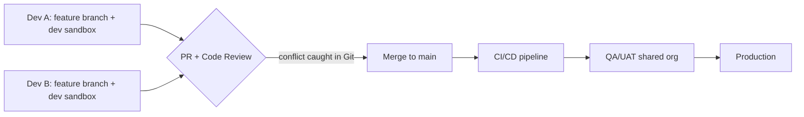
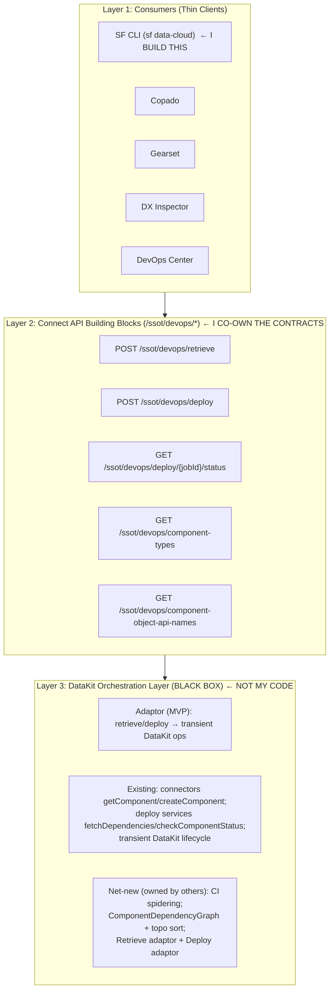
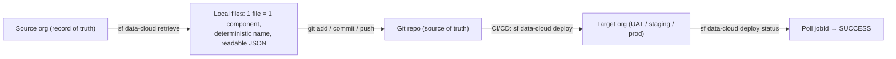
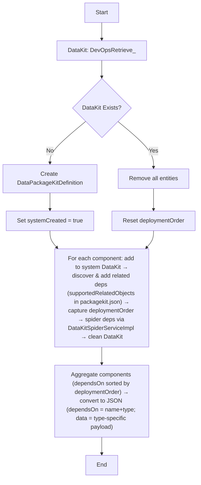
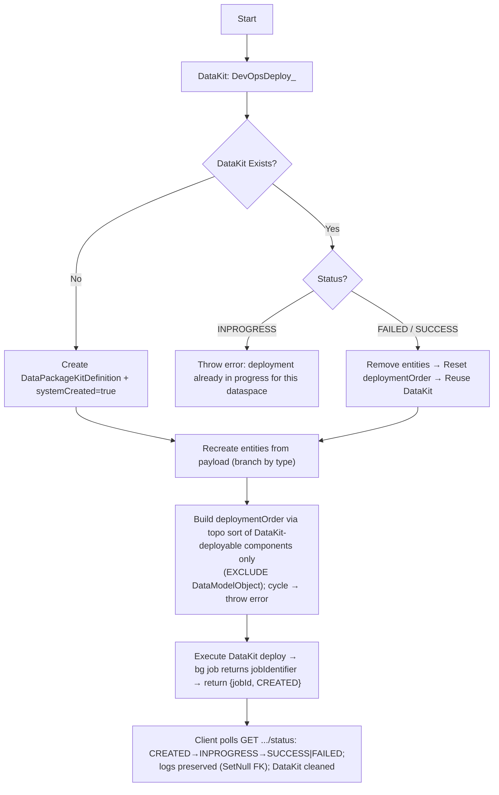

# PROJECT_KNOWLEDGE.md — Master Context for `@salesforce/plugin-datacloud-devops`

> **Read me first (for AI coding agents).** This is the single source of truth for this
> internship project. Treat every rule here as binding. When a task seems to fall outside
> Section 2 (Scope), **stop and flag it** rather than inventing functionality. When you need a
> JSON shape, an endpoint, or a file path, use Section 5 verbatim — **do not hallucinate field
> names, endpoints, or component types.** Conflicts between source documents have already been
> resolved below; where a value is still unconfirmed it is explicitly marked `⚠️ TBD / CONFIRM`.
>
> **Who I am:** Arpit Shukla, an intern building this internal Salesforce CLI plugin. I drive AI
> coding agents (Claude Code, Cursor) to help me build it. Keep me inside scope; keep the code
> modular and production-shaped; never touch the server-side or orchestration internals.
>
> **Golden rules for the agent:**
>
> 1. The CLI is a **thin client**. All real logic lives server-side behind Connect APIs I do **not** implement.
> 2. I own the **CLI** + the **Connect API contracts** (representation classes). I do **not** own the Connect API _implementation_, _spidering_, or the _DataKit Orchestration Layer_.
> 3. In-scope component types for end-to-end work: **CalculatedInsight + its DMO dependencies only.** Write code generically so it _could_ extend to all ~30+ types, but only CI+DMO must work end-to-end.
> 4. Deterministic file naming, human-readable JSON, flat-by-type directory structure — these are non-negotiable design invariants (they are the whole point of the project).
> 5. Never reference DataKit constructs, template names, or `&quot;`-encoded XML in CLI output or local files — those are hidden implementation details.
> 6. Future-Proof & Modular Design: The CLI codebase and directory structure must be highly modular and production-ready from day one. Write code architecture generically so it scales seamlessly to all 30+ component types, avoiding hardcoded, single-use logic.

---

# 1. Project Overview & Architecture

## 1.1 What this project is

**Source design doc:** `[264] DevOps for Data 360` (47 pages, March 2026). Authors: Ayush Singhal,
Nivetha Shreeram, Himanshu Shekhar, Rohit Kumar Maurya; inputs from Sudheer Kumar Kanaka, Nikhil
Kapre. **Status: Draft** (lifecycle: `Draft → Proposed → Adopted → Deprecated`).

The goal is to build **fundamental DevOps building blocks for Data Cloud (a.k.a. Data 360)** so that
Salesforce DevOps Center, DX Inspector, and external ISVs (**Copado, Gearset, Flosum**) can build
robust source-controlled DevOps experiences — plus a standardized **`sf data-cloud` CLI plugin** at
parity with the core `sf project retrieve / deploy` experience.

**The problem today:** every Data Cloud metadata change flows through the **DataKit UI** — a manual,
per-change, 6-UI-step bundling process that produces opaque template files with random alphanumeric
names and JSON-inside-XML payloads encoded with `&quot;`. This **breaks Git** (no meaningful diffs,
history resets every retrieve, silent multi-developer overwrites) and **cannot be driven by AI agents**
(they can't click UI buttons, can't track non-deterministic names, can't decode the payload format).

**The fix:** replace that experience with **component-level retrieve/deploy** that feels identical to
`sf project retrieve start` — zero UI steps, deterministic API-name-based file names, clean native
JSON, and three headless Connect API endpoints any consumer (human or agent) calls identically.

## 1.2 Business impact (why this matters)

- Salesforce's core CRM/metadata platform has a mature extensibility ecosystem; **Data 360 does not yet** — it's a newer platform.
- **Data 360 is one of Salesforce's fastest-growing businesses: $1B+ annual run rate within 5 years, triple-digit YoY growth.**
- **Agentforce builds on Data 360** as its data layer → adoption is accelerating; customers expect core-platform DevOps capabilities to extend to Data Cloud.
- **Business proposition 1:** Better Data 360 DevOps → better adoption → more revenue. Primary path = integrate with 3rd-party DevOps ISVs (Copado, Gearset, Flosum), whose current Data 360 DevOps solutions get poor customer feedback.
- **Business proposition 2:** **Agentforce vibes** — an AI-coding editor to prototype Salesforce/Data 360 configs via Gen AI (e.g., create a CalculatedInsight via an agent). Not yet supported; this work enables it.
- **Sandbox context:** customers run ~7 sandboxes per 1 production org. Changes flow dev-sandbox → full sandbox (integration test) → production via automated pipelines. This CLI facilitates that — "the software is actually Salesforce metadata."

## 1.3 Glossary (authoritative term definitions)

| Term                            | Definition                                                                                                                                                    |
| ------------------------------- | ------------------------------------------------------------------------------------------------------------------------------------------------------------- |
| **DataKit**                     | Data Cloud packaging construct bundling components into a deployable unit; contains templates. **Hidden from the developer in this project.**                 |
| **Template**                    | Serialized single component inside a DataKit; JSON-inside-XML with `&quot;` encoding; random alphanumeric names. **Never exposed to CLI users.**              |
| **DLO**                         | Data Lake Object — raw ingestion-layer entity. DLO _definitions_ are dataspace-agnostic (org-level).                                                          |
| **DMO**                         | Data Model Object — harmonized model entity. Standard DMOs (Individual, Account) are platform-provided; custom DMOs are user-created. Dataspace-scoped.       |
| **CI**                          | Calculated Insight — a SQL-defined computed metric over DMOs or other CIs. **Primary in-scope type.**                                                         |
| **IR**                          | Identity Resolution — matching/reconciliation ruleset unifying records across DMOs.                                                                           |
| **Spidering**                   | Recursively discovering all transitive dependencies of a component (e.g. a CI → the DMOs it queries). **Server-side spidering is out of my scope.**           |
| **MDS**                         | Metadata Store — Data Cloud's internal metadata persistence (separate from MDAPI).                                                                            |
| **Connect API**                 | Modern REST framework (`/services/data/vXX.0/connect/...`); Data Cloud exposes components under the `/ssot/` namespace. **This project is Connect-API-only.** |
| **MDAPI**                       | Metadata API — core platform transport for `sf project deploy/retrieve`. Being deprecated for Data Cloud entities.                                            |
| **System DataKit**              | Internally-managed DataKit (one per data space) used to execute deploy. **Never visible to developers.**                                                      |
| **Dependency Graph**            | DAG of dependencies; topological sort yields the correct deployment order.                                                                                    |
| **DataKit Orchestration Layer** | The "black box" Layer 3 that hides all DataKit complexity. **Not my code.**                                                                                   |

## 1.4 The standard Salesforce developer loop (the bar Data Cloud must hit)

Seven properties every ISV tool and CI/CD pipeline assumes:

1. **1:1 file mapping** (one `.cls` per Apex class)
2. **Deterministic names** (file name = component API name)
3. **Human-readable format** (indented, reviewable, mergeable)
4. **Selective retrieve** (`--metadata ApexClass:X` gets one component)
5. **Dependency-aware deploy** (platform resolves deps)
6. **`package.xml` manifest** (declarative, auditable, reproducible)
7. **Source tracking** (`SourceMember` tracks org-side changes)

Data Cloud violates all seven today via DataKit. This project restores them (except source tracking, which is deferred).

## 1.5 Promotion model (Git as single source of truth)



> **Critical invariant: Git is the single source of truth.** No change reaches production without a
> branch, a PR, a review, and an automated pipeline. Sandboxes are disposable; Git is the permanent
> record. The current DataKit flow breaks this with the "two-hop" problem (sandbox → target org with
> no Git-mediated step), causing **silent overwrites** between developers.

## 1.6 Three-layer architecture (the core mental model)



> **Black-box boundary:** the long-term "north star" can replace adaptor internals (drop transient
> DataKits, switch to direct CRUD orchestration, add S3 storage) **without changing any consumer or
> API contract.** This is exactly why the contracts I own must be production-quality and stable.

## 1.7 CLI command → Connect API mapping (★ my build target)

| CLI Command                         | HTTP | Connect API Endpoint                                                        | Purpose                                             |
| ----------------------------------- | ---- | --------------------------------------------------------------------------- | --------------------------------------------------- |
| `sf data-cloud component-type list` | GET  | `/ssot/devops/component-types`                                              | List supported DC component types                   |
| `sf data-cloud component list`      | GET  | `/ssot/devops/component-object-api-names?componentType=<>&dataSpaceName=<>` | List components of a type in the org                |
| `sf data-cloud retrieve`            | POST | `/ssot/devops/retrieve`                                                     | Retrieve component + transitive deps as JSON        |
| `sf data-cloud deploy`              | POST | `/ssot/devops/deploy`                                                       | Deploy components in dependency order to target org |
| `sf data-cloud deploy status`       | GET  | `/ssot/devops/deploy/{jobId}/status`                                        | Poll async deploy status                            |

- **Operate within a single dataspace.** Cross-dataspace operations are not supported.
- A "component" = one definition (one CI = one component; one Segment = one component).
- CLI namespace is **`data-cloud`** for now; **may be renamed to `d360` / `D3` later** (open question).

## 1.8 End-to-end pipeline (target experience)



> Total UI clicks on Data Cloud UIs in the target experience: **zero** (vs 6 UI steps today).

## 1.9 Multi-developer conflict resolution

Both developers retrieve the SAME component to the SAME deterministic path
(`data-cloud/default/calculated-insights/HighValueCustomers.json`). Dev A merges first → Git detects
the conflict on Dev B's PR → resolved in Git → CI/CD deploys the merged result. The enabler is
**deterministic file naming (FR-5)** — impossible with DataKit's random template names.

## 1.10 Retrieve & Deploy server flows (context — NOT my code, but my contracts must match)

**Retrieve (Connect API, transient DataKit):**



**Deploy (Connect API):**



> Deploy nuance: **`deploymentOrder` includes only DataKit-deployable components; DMOs are excluded
> from the order even though they're in the payload.**

## 1.11 AI-era design principles (from the "Review Pillars" doc)

The design deliberately removes three pre-AI assumptions so an **agent can be a first-class consumer**:

- **Zero UI steps** (agents can't click).
- **Deterministic API-name-based file names** (agents can't track random names).
- **Clean native JSON** (agents have no `&quot;` decoder).
- Endpoints are **stateless, JSON-in/JSON-out, MCP-ready.**
- **Errors must be machine-parseable** (codes + messages + failing component) — **not gacks.**
- Per-component status is structured (`CREATED / SKIPPED / FAILED`) for autonomous monitoring.

**Irreversible risks (long-term support burden):** once JSON entities are exposed, the folder
structure is set, and ISVs depend on the Connect API, all three become permanent contracts.

---

# 2. My Exact Internship Scope (Strict Boundaries)

**I own two of the three layers: the CLI (Layer 1) and the Connect API _contracts_ (Layer 2 representation classes). A separate developer owns the Connect API _implementation_ and spidering. We pair-review each other's work.**

## 2.1 The five CLI commands (TypeScript / oclif) — primary deliverable

Build all five, merge to the branch, ≥80% unit-test coverage:

1. **`sf data-cloud component-type list`** → `GET /ssot/devops/component-types`
2. **`sf data-cloud component list`** → `GET /ssot/devops/component-object-api-names?componentType=<>&dataSpaceName=<>`
3. **`sf data-cloud retrieve`** → `POST /ssot/devops/retrieve` (start in **manual/mock mode**, move to API mode when the endpoint is ready)
4. **`sf data-cloud deploy`** → `POST /ssot/devops/deploy`
5. **`sf data-cloud deploy status`** → `GET /ssot/devops/deploy/{jobId}/status`

## 2.2 Connect API contracts (Java) — co-owned

- Define the input/output **representations** for `retrieve`, `deploy`, and `deploy status`.
- Production-quality from day one: `@ConnectInputRep` / `@ConnectOutputRep`, the **`_isSet` pattern**, `minVersion`, **permission checks**.
- The senior developer's implementation must consume these **without modification** → sign off the contract with Arushi / Himanshu / Priya before they implement.

## 2.3 Client-side responsibilities (these ARE mine)

- **Persist** the retrieve API response to the local file system as **one file per component** with a **deterministic, API-name-based name**, in the **flat-by-type, dataspace-aware directory structure** (Section 5).
- **Client-side multi-file handling:** when a CI retrieve returns the CI _plus_ its spidered DMO dependencies, **split the response into the correct files/directories.** (The _server_ does the spidering; the _client_ handles the multi-component response.)
- **Transitive dependency walk on deploy (CLI-side):** starting from user-specified components, read each `dependsOn`, walk the local files until all transitive deps are collected (skip already-visited), build the deploy payload.

## 2.4 Observability (mine)

- Command latency (p50/p99), deploy success/failure rates, per-command counts, error breakdown by code.
- **Structured logs in Splunk; metrics in Argus.**
- **Correlation IDs** spanning CLI → Connect API → DataKit.
- Reference the existing Salesforce `sf` CLI for how it logs and emits metrics, and mirror that.

## 2.5 Later-phase surfaces (mine, weeks 4–5)

- **MCP server** wrapping the CLI: five tools — `dc_devops_component_type_list`, `dc_devops_component_list`, `dc_devops_retrieve`, `dc_devops_deploy`, `dc_devops_deploy_status`. LLM-friendly descriptions + input schemas + structured actionable errors. Telemetry `surface=mcp`.
- **Agentforce DevOps assistant** (a single canonical flow, not a general-purpose agent): actions wired to the Connect APIs directly or via MCP. Telemetry `surface=agentforce`. Demo: _"Deploy the HVC calculated insight to staging"_ → lookup → deploy → poll → post summary.

## 2.6 Component-type coverage

- **End-to-end demo target: CalculatedInsight + its DMO dependencies only.**
- **Dummy `retrieve` (current sprint):** CI **and Data Transform** (two process-definition types). Mock CI response should include a `dependsOn` array (backend will auto-spider).
- Write code **generically** so it could work for all ~30+ supported types, but only CI+DMO must work end-to-end.

## 2.7 Definition of success

- E2E demo: retrieve CI + DMOs from source org → commit to Git → deploy to target org → poll → **SUCCESS**, no Setup UI.
- All five commands merged to the **`develop`** branch (`⚠️ CONFIRM` — see §4.7).
- Argus dashboard (latency p50/p99, deploy success rate, per-command counts, error breakdown); Splunk structured logs.
- **FIT tests** for retrieve → deploy → status against an **orgfarm** org, passing in **SFCI**.
- **≥80% unit-test coverage** (JUnit) on CLI and contract classes.
- DevOps flow demonstrated across all three surfaces (CLI / MCP / Agentforce).

---

# 3. Out of Scope (Do Not Touch)

**The agent must refuse or flag any task that drifts into these areas:**

- ❌ **Server-side spidering** — owned by another developer (Arushi/Himanshu/Priya). I only handle the client-side multi-file split of an already-spidered response.
- ❌ **Connect API _implementation_** — building the actual endpoints, the temporary DataKit, the exact server payloads, the deploy/retrieve adaptors. I define and sign off the _contracts_ only.
- ❌ **DataKit Orchestration Layer** (Layer 3) — transient DataKit lifecycle, template reconstruction, topological sort, cycle detection. Stretch-goal _learning_ only, never a primary deliverable.
- ❌ **Component types beyond CalculatedInsight and DMO** for end-to-end work (Data Transform appears only in the dummy/mock sprint).
- ❌ **Live backend API execution / writing core Salesforce CLI logic** — never modify core `sf` internals; the plugin is additive and thin.
- ❌ **Touching DataKit constructs in CLI output or local files** — no DataKit names, template names, `&quot;`-encoded XML, or internal dependency objects may surface to the user or land on disk.
- ❌ **Transactional deploy (FR-9)** — listed as a functional requirement but **deferred** (server-side transaction coordination; fast-follow).
- ❌ **Source tracking / delta retrieval** — no `SourceMember` equivalent; deferred.
- ❌ **Multi-component / bulk retrieve-deploy** — MVP is per-component (one named component + its dependency graph).
- ❌ **Multi-dataspace deploys** — single dataspace only.
- ❌ **DC + non-DC mixed packages** — cross-team, deferred.
- ❌ **ISV integration testing** (Copado/Gearset/Flosum) — happens after this work.
- ❌ **Agentforce admin UI and OAuth flows; MCP server packaging/distribution beyond the demo.**
- ❌ **VS Code extension, scratch org support, DC1 companion org support** — future scope.
- ❌ **Any production cutover.**
- ❌ **Inventing endpoints, fields, component types, or file shapes** not present in Section 5.

---

# 4. Environment & Tech Stack Rules

## 4.1 Hardcoded rules (binding)

| Rule                            | Value                                                 | Source / status                                                         |
| ------------------------------- | ----------------------------------------------------- | ----------------------------------------------------------------------- |
| **Node version**                | **v24**                                               | ✅ Confirmed. Downgraded from v26 to bypass a scaffolding bug.          |
| **Toolchain versions**          | **Match what other Salesforce plugins currently use** | ✅ Rule from Himanshu — never force customers into custom environments. |
| **CLI language**                | **TypeScript** (all command implementations)          | ✅ Confirmed.                                                           |
| **CLI framework**               | **oclif**                                             | ✅ From charter.                                                        |
| **Package manager**             | **Yarn only** (no `npm install`)                      | ✅ Confirmed.                                                           |
| **Commit convention**           | **Conventional Commits enforced**                     | ✅ Confirmed. (Existing repo commit `chore: scaffold...` follows this.) |
| **CLI dev IDE**                 | **VS Code**                                           | ✅ Confirmed — preferred for CLI work; customers also use VS Code.      |
| **Java / backend-contract IDE** | **IntelliJ** (+ **Bazel** build)                      | ✅ IntelliJ confirmed for backend/code side; Bazel from intern brief.   |

## 4.2 Connect API contract code (Java) conventions

- Annotations: **`@ConnectInputRep` / `@ConnectOutputRep`**.
- **`_isSet` pattern** for optional-field presence detection.
- **`minVersion`** on every representation/field.
- **Permission checks** required.
- Reference module to study patterns: **`cdp-connect-api/`** (annotation patterns, `_isSet` methods, representation builder pattern). Use Claude Code to explain these.

## 4.3 Testing

- **Unit tests: JUnit, ≥80% coverage** on CLI and contract classes. Also write CLI unit tests for the lightweight list commands.
- **FIT tests:** retrieve → deploy → status against an **orgfarm** org, passing in **SFCI**.

## 4.4 Observability stack

- **Splunk** — structured logs (set up for server-side log visibility).
- **Argus** — metrics / dashboards.
- **Correlation IDs** across CLI → Connect API → DataKit.

## 4.5 AI tooling

- **Claude Code** (CLI + VS Code extension). Run `/init` on the CLI repo to generate `CLAUDE.md`. Use it to explore code and explain Connect API annotation patterns.
- **Cursor** (Pro) — `⚠️` had activation issues; Arushi helps set it up.
- **MCP server** (week 4), **Agentforce vibes** (week 5).

## 4.6 Orgs & repo

- **Two orgfarm orgs** with Data Cloud enabled (named like **prod1 / prod2**) — deploy a CI from one to the other.
- Enable the Data Cloud DevOps permission/preference (`"BT"` in transcript — `⚠️` exact name TBD) **on BOTH orgs**. Tip: open the permission page in an **incognito window** to avoid orgfarm session conflicts.
- **CLI works only with the "DevOps" DataKit type — not "Standard."**
- **Repo:** the one Ayush shared (contains multiple plugins) → **create our own new plugin inside it** (plugin name TBD). Code must be **modular** with **correct directory/file structure** — this is the backbone of all future changes and must be extensible toward production.
- Current repo: `plugin-datacloud-devops`, scaffolded via `sf dev generate plugin`. Working branch: `feature/initial-setup`.

## 4.7 Branch strategy (⚠️ CONFIRM)

Sources conflict: charter Goals say "merge to feature branch" while Success criteria + Week 6 say
"merged to **`develop`** branch." Git context shows working branch `feature/initial-setup` and main
branch `main`. **Treat `develop` as the integration target unless told otherwise; confirm with Ayush.**

---

# 5. API Contracts & Data Structures

> These are the exact shapes the CLI consumes/produces. **Do not invent fields.** Where the design
> doc and the dedicated JSON-examples doc disagree, the **JSON-examples doc wins for files on disk.**

## 5.1 Canonical conventions (file format)

- **Dataspace-first layout.** 1 component = 1 file, named **`{componentName}.json`**.
- Each file is **self-describing**: `componentType`, `componentName`, `dataspaceName`, `dependsOn[]`, **`entityPayload{}`**.
  - ⚠️ Naming note: the retrieve API _response_ uses `entitypayload` (lowercase) in one design-doc example and `data` in another; the **on-disk file format spec uses `entityPayload` (camelCase)** — use `entityPayload` for files written to disk.
- Root **`manifest.json`** captures the flattened **`deploymentOrder`**.
- **No DataKit XML, no `&quot;` encoding, no internal link tables** — indented native JSON only.
- File names are deterministic: **`{APIName}.json`**.

## 5.2 Directory structure (dataspace-aware, flat-by-type)

```
data-cloud/
├── data-lake-objects/                 ← DLO DEFINITIONS (dataspace-AGNOSTIC, org-level)
│   ├── Calendar_Home.json
│   └── S3_Sales.json
├── default/                            ← dataspace: "default"
│   ├── data-connections/
│   ├── data-model-objects/             ← DMOs (dataspace-specific)
│   │   ├── Individual.json
│   │   └── SalesOrder.json
│   ├── calculated-insights/
│   │   └── HighValueCustomers.json
│   ├── segments/
│   ├── data-transforms/
│   ├── identity-resolutions/
│   ├── data-streams/
│   ├── data-actions/
│   └── dataspace-member-filters/       ← DLO membership in this dataspace (dataspace-specific)
│       └── Calendar_Home.filter.json
├── custom_space/                       ← dataspace: "custom_space"
│   └── ...
└── manifest.json                       ← dependency graph + deploy order
```

- **Use kebab-case, plural folder names** (`calculated-insights/`, `data-model-objects/`) — authoritative per the JSON-examples spec. (Verbal/older variants like `CalculatedInsight/` or singular `calculated-insight/` are superseded.)
- **DLO definitions live OUTSIDE dataspaces; their dataspace member filters live INSIDE the dataspace folder.** DMOs/CIs/Segments/Transforms/IRs/Streams/Actions are all dataspace-scoped. (⚠️ The team is still working out how to separate non-dataspace entities — treat as unsettled.)

## 5.3 Endpoint 1 — List Supported Component Types

```
GET /ssot/devops/component-types
```

Response (key = `componentType` value to pass in CLI; value = display label; powered by `packagekit.json`):

```json
{
  "supportedComponentTypes": {
    "DataConnection": "Data Connection",
    "DataStreamBundle": "Data Stream",
    "CalculatedInsight": "Calculated Insight",
    "DataLakeObject": "Data Lake Object",
    "DataTransform": "Data Transform",
    "IdentityResolution": "Identity Resolution",
    "DataGraph": "Data Graph",
    "...": "..."
  }
}
```

> Count of supported types varies across sources (docs cite **34–41**; transcript says ~36). Write
> "**30+ supported component types; only CalculatedInsight + DMO in scope.**"

## 5.4 Endpoint 2 — List Components by Type

```
GET /ssot/devops/component-object-api-names?componentType=CalculatedInsight&dataSpaceName=default
```

| Query Param     | Required | Description                  |
| --------------- | -------- | ---------------------------- |
| `componentType` | Yes      | Key from component-types API |
| `dataSpaceName` | Yes      | Dataspace developer name     |

Response:

```json
{
  "components": [
    { "componentName": "highValueCustomer", "lastModifiedDate": "2026-04-15T10:30:00Z" },
    { "componentName": "revenueCI", "lastModifiedDate": "2026-04-10T08:00:00Z" }
  ]
}
```

## 5.5 Endpoint 3 — Retrieve Components

```
POST /ssot/devops/retrieve
```

Request:

```json
{
  "dataSpaceName": "default",
  "components": [
    { "componentType": "CalculatedInsight", "componentName": "highValueCustomer" },
    { "componentType": "DataTransform", "componentName": "myTransform" }
  ]
}
```

Response (each component self-describing; `dependsOn` lists deps; payload key is `entitypayload`/`data` in the API, written as `entityPayload` on disk):

```json
{
  "components": [
    {
      "componentType": "CalculatedInsight",
      "componentName": "highValueCustomer",
      "dependsOn": [{ "componentName": "Divvy_TripsDmo", "componentType": "DataModelObject" }],
      "dataspaceName": "default",
      "entityPayload": {
        "masterLabel": "testCI",
        "expression": "SELECT COUNT(Divvy_TripsDmo__dlm.DataSource__c) AS cnt__c, Divvy_TripsDmo__dlm.from_station_name__c AS grp__c FROM Divvy_TripsDmo__dlm GROUP BY grp__c",
        "builderExpression": {
          "app": { "insightType": "CALCULATED_METRIC", "targetCurrencyType": "" },
          "dataNodes": { "...": "..." },
          "ui": { "...": "..." },
          "relatedDMOs": []
        },
        "definitionType": "CALCULATED_METRIC",
        "creationType": "Custom",
        "scheduleInterval": "0",
        "sourceObjectDevName": "testCI"
      }
    }
  ]
}
```

- A leaf DMO has `"dependsOn": []` and an `entityPayload` with `objectApiName`, `masterLabel`, `fields[]`.

## 5.6 Endpoint 4 — Deploy Components

```
POST /ssot/devops/deploy
```

Request: `{ "dataSpaceName": "default", "components": [ { componentName, componentType, dependsOn[], data:{...} } ] }`

Response:

```json
{ "jobId": "08PVF000002iQIb", "status": "CREATED" }
```

- **Status lifecycle: `CREATED → INPROGRESS → SUCCESS | FAILED`.** Async — client polls by `jobId`.

## 5.7 Endpoint 5 — Get Deploy Status

```
GET /ssot/devops/deploy/{jobId}/status
```

Response (failure example):

```json
{
  "jobId": "DEVOPS_xxxxxxxx",
  "status": "FAILED",
  "components": {
    "componentName": "highValueCustomer",
    "componentType": "CalculatedInsight",
    "status": "FAILED",
    "error": "Expression validation failed: Unknown field DataSource__c on Divvy_TripsDmo__dlm"
  }
}
```

- Per-component status values seen: `CREATED / SKIPPED / FAILED` (and `SUCCESS`/`SUCCEEDED` overall).
- Component-level status read from `DataKitDeploymentLog` filtered by `jobId` (new `jobIdentifier`/`DevopsJobId` field). **(Backend detail — context only.)**

## 5.8 Manifest shape

```json
{
  "deploymentOrder": [
    { "componentType": "DataConnection", "componentName": "conn_first", "dataspaceName": "default" },
    { "componentType": "DataLakeObject", "componentName": "conn_first_runner_profiles", "dataspaceName": "default" },
    {
      "componentType": "DataModelObject",
      "componentName": "conn_first_runner_profiles_dmo",
      "dataspaceName": "default"
    },
    { "componentType": "DataStream", "componentName": "ing3", "dataspaceName": "default" }
  ]
}
```

- One Transform example placed `dataspaceName` at the top level instead of per-entry — both forms seen.

## 5.9 Per-type `entityPayload` shapes (from the JSON-examples spec)

- **DataConnection:** `{ name/devName, label/masterLabel, connectorType/dataConnectorType, method, status, [alias, dsTenantDevName, dsTenantMasterLabel, credentials[], params[]] }`
  - Databricks adds `credentials:[{paramName:"credentialType", value:"servicePrincipalAuthentication"}]` and `params:[{jdbc_connection_url}, {httpPath}]`.
- **DataLakeObject:** `{ type:"DLO", developerName, dataSpaceName, schema:{ externalObjectName, [externalDatabaseName, externalSchemaName], fields:[{name, type|externalDataType, primaryIndexOrder?}] } }` OR a `dataSpaceFilterCriteriaRepresentation` (filter conditions).
- **DataModelObject:** `{ objectApiName (..__dlm), masterLabel, category, fields:[{name(..__c), label, type, isPrimaryKey, keyQualifierField?}], relationships:[{name, fromField, toObject, toField, cardinality}] }`.
- **DataStream:** `{ label, dataPlatform (IngestionApi|AwsS3|Databricks), sourceObjectName, streamType (BATCH|DIRECT_ACCESS), refreshMode (FULL_REFRESH), refreshFrequency (NONE), [extDataTranObjectTemplate, objectCategory], dataSourceObject:{ name, externalName, fields:[{name, externalDataType, primaryIndexOrder?}] }, mappings:[{sourceField, targetObject (..__dlm), targetField (..__c)}] }`.
- **DataTransform:** `{ label, type:"BATCH", name, version, definitions:[{nodes:{ LOAD_DATASET0:{action:"load", sources:[], parameters:{dataset, fields[], sampleDetails}}, OUTPUT0:{action:"outputD360", sources:[...], parameters:{name, type, writeMode:"MERGE", priority, fieldsMappings:[...]}}}}], Output:[{ ...new DMO definition... }] }`.

## 5.10 Backend data-model changes (context only — not my code)

- `DataPackageKitDefinition.systemCreated` (Boolean, new) → hides DataKit from UI; all devops DataKits set `true`.
- `DataKitDeploymentLog.jobIdentifier` (Text) → unique devops run ID; **SetNull FK** so logs survive DataKit deletion.
- `DataKitObjectTemplate.componentDeveloperName` (Text, new) → stores real component developer name.

---

# 6. Weekly Timeline, Mentor Tips & Current Progress

## 6.0 People & cadence

| Person                  | Role                                                                                             |
| ----------------------- | ------------------------------------------------------------------------------------------------ |
| **Arpit Shukla**        | Me — the intern. Owns CLI + API contracts + observability + MCP + Agentforce.                    |
| **Ayush Singhal**       | Mentor / tech lead. Authored the design doc; set the weekly plan; runs the sandbox/DevOps scrum. |
| **Arushi Sinha**        | My buddy. Server-side / headless. Helps with setup; ask anytime (replies may be delayed).        |
| **Himanshu Shekhar**    | Co-owns Connect API / server side; gave the directory-structure spec + sprint targets.           |
| **Priya**               | Works with Arushi/Himanshu on Connect API + server side.                                         |
| **Shashank Sardana**    | Engineering Manager, sandbox & DevOps work stream.                                               |
| **Hari Priyanka Nunna** | Facilitator; creates per-intern plan docs.                                                       |

- **Scrum:** DevOps scrum team, **11:30 AM Tue/Wed/Thu** (no scrum Fri). I joined effective Jun 2, 2026.
- **Sprints are 1 week** (weekly goal review to stay on track), unlike the team's 2-week sprint review.
- **Process habits (from buddy):** keep a **daily work log** (combine into weekly updates; share with both Ayush and Arushi); **track blockers**; **ask doubts directly in the project Slack channel — don't wait**; try AI (Claude/Cursor) for errors first, then the channel.
- Approximate calendar (kickoff Jun 1; today Jun 4, 2026): W0 ≈ Jun 1–5 · W1 ≈ Jun 8–12 · W2 ≈ Jun 15–19 · W3 ≈ Jun 22–26 · W4 ≈ Jun 29–Jul 3 · W5 ≈ Jul 6–10 · W6 ≈ Jul 13–17 · W7 ≈ Jul 20–24. _(Approximate — confirm exact dates.)_

---

### Week 0 — Onboarding

**Goals:**

- Set up Claude Code (CLI + VS Code ext, auth, run `/init` → `CLAUDE.md`); practice exploring code.
- Set up workspace dev env: core build, CLI repo, VS Code; run core on workspace.
- Read `[264] DevOps for Data 360` (focus: Recommended Approach).
- Spin up an orgfarm org with Data Cloud enabled; create a CalculatedInsight with DMO dependencies.
- Study Connect API patterns in `cdp-connect-api/` (annotations, `_isSet`, representation builder).

**Mentor Tips / Meeting Notes:**

- Goals are 1-week so we review weekly and help you navigate.
- Set up Splunk (server-side log visibility) and the MCP server early (the MCP server matters for week 4).
- Share your PPT/design-doc assessment with Arushi, Shashank, and Himanshu for validation.
- (Buddy) Enable the DevOps permission on **both** orgs; open the permission page in **incognito** to avoid orgfarm session conflicts; CLI only works with the **DevOps** DataKit type (not Standard); sandbox is a point-in-time copy (a CI created after provisioning won't appear in it).

**Current Status:** Week 0 in progress (week of ~Jun 1). Joined the scrum (Jun 2); met Arushi (buddy) and Shashank (EM). PPT assessment prepared (to share). Repo scaffolded (`sf dev generate plugin`) on `feature/initial-setup`. In flight: Splunk setup, MCP server setup, two orgfarm orgs (prod1/prod2), CI + DMO creation. **Downgraded Node v26 → v24** to fix the scaffolding bug.

---

### Week 1 — Define API contracts (Java) + CLI scaffolding

**Goals:**

- Implement `sf data-cloud component-type list` and `sf data-cloud component list`.
- Write CLI unit tests.
- Define Retrieve, Deploy, and Deploy-Status API contracts.
- **Current sprint refinement:** all **five dummy commands present and runnable in LOCAL, returning dummy/random data** (each shows its parameters + a dummy response). Implement the dummy `retrieve` for **CI + Data Transform** specifically.
- **Stretch goal:** get the CLI to connect to any orgfarm org and successfully hit _any_ Connect API (just prove connectivity) — sets up week 2.

**Mentor Tips / Meeting Notes:**

- (Himanshu) Code must be **modular** with **correct directory/file structure** — this is the backbone of all future changes; make it extensible toward production.
- (Himanshu) Toolchain versions must match other Salesforce plugins — don't force customers into custom environments.
- (Himanshu) The mock CI `retrieve` response should include a `dependsOn` array (backend auto-spiders).
- (Himanshu) Plugin development differs from how the CLI itself works — start with the plugin; try the actual CLI deploy flow only if time permits (low priority).
- (Both) Once dummy commands work locally, **ping the team on Slack for validation** before next steps.
- VS Code for CLI work; IntelliJ for Java/backend.

**Current Status:** Week 1 work started during the Week 0 window. Plugin scaffolded inside the shared repo; building the five dummy commands; dummy `retrieve` targeting CI + Data Transform. Cursor Pro activation pending (Arushi helping).

---

### Week 2 — Retrieve and Deploy CLI (mock)

**Goals:**

- Implement `sf data-cloud retrieve` against mock `POST /ssot/devops/retrieve`.
- Implement `sf data-cloud deploy` against mock.
- Implement `sf data-cloud deploy status` against mock.
- Persist API responses to the file system; split multi-component responses into the correct files/dirs (Section 5.2).

**Mentor Tips / Meeting Notes:**

- Likely use **your own mocks** (the senior devs' real APIs may not be ready until week 3–4).
- After getting a CI definition from the API, persist it to the file system.

**Current Status:** _TBD — not yet started._

---

### Week 3 — API integration, hardening, and observability

**Goals:**

- Wire retrieve, deploy, and deploy-status to the real REST APIs.
- Edge-case handling.
- Metrics + logs (Splunk/Argus; correlation IDs); reference the existing `sf` CLI.
- End-to-end test for Calculated Insights.

**Mentor Tips / Meeting Notes:**

- Expect many edge cases once coding for real; decide what to log and what to push metrics on.
- Target: by end of week 3, CLI works with mocked APIs (if not the exact APIs) and can get a CI definition from the source org and deploy to the target org.

**Current Status:** _TBD — not yet started._

---

### Week 4 — MCP server wrapping the CLI

**Goals:**

- Five MCP tools: `dc_devops_component_type_list`, `dc_devops_component_list`, `dc_devops_retrieve`, `dc_devops_deploy`, `dc_devops_deploy_status`.
- Tool descriptions + input schemas designed for LLM consumption; structured, actionable error messages.
- Telemetry tagged `surface=mcp`.
- Demo: Claude Code invoking the MCP server to retrieve, commit, deploy, and poll — without typing CLI flags.

**Current Status:** _TBD — not yet started._

---

### Week 5 — Agentforce DevOps assistant

**Goals:**

- A focused Agentforce agent in a dev org with actions wired to the Connect APIs (directly or via MCP tools).
- Telemetry tagged `surface=agentforce`.
- Demo: in an Agentforce panel, _"Deploy the HVC calculated insight to staging"_ → lookup → deploy → poll → post summary. A single canonical flow, not a general-purpose agent.

**Mentor Tips / Meeting Notes:**

- Agentforce vibes = an evolved Claude alternate as the reasoning agent; it works in sandboxes; you port your MCP server to it.

**Current Status:** _TBD — not yet started._

---

### Week 6 — Hardening and presentation preparation

**Goals:**

- Resolve all issues across all three surfaces (CLI, MCP, Agentforce).
- Code merged to the `develop` branch.
- Presentation deck covering CLI, MCP, and Agentforce.
- Demo rehearsed per-surface.

**Current Status:** _TBD — not yet started._

---

### Week 7 — Final presentation and handoff

**Goals:**

- Demonstration across the three surfaces (CLI, MCP, Agentforce): deploy CI + DMOs source-org → target-org.
- Markdown doc: how to register the MCP server with another agent + Agentforce productionization notes.

**Mentor Tips / Meeting Notes:**

- Week 7 is for hardening + presentation; build incrementally and don't look too far ahead (Shashank).
- Two underlying themes: (1) build something cool; (2) experience what it takes to ship to production.

**Current Status:** _TBD — not yet started._

---

# 7. Troubleshooting & Known Issues

> Running log — append every recurring mistake / gotcha so they aren't repeated.

| #   | Issue                                                                              | Resolution / Note                                                                                                                                                                       |
| --- | ---------------------------------------------------------------------------------- | --------------------------------------------------------------------------------------------------------------------------------------------------------------------------------------- |
| 1   | **Node v26 crashes the SF CLI plugin generator (scaffolding bug).**                | **Use Node v24.** Also keep toolchain versions matched to other Salesforce plugins (don't force custom envs).                                                                           |
| 2   | **DevOps permission must be enabled on BOTH orgs.**                                | The CI-from-one-org-to-another flow needs the Data Cloud DevOps permission/preference (`"BT"` in transcript — ⚠️ confirm exact name) enabled on prod1 _and_ prod2.                      |
| 3   | **DevOps permission page fails when orgfarm is already open in the same browser.** | Open the permission page in an **incognito window** to avoid session conflicts.                                                                                                         |
| 4   | **CLI only works with the "DevOps" DataKit type — not "Standard."**                | Delete the Standard DataKit; create a DevOps DataKit, add the CI, then Download Manifest to inspect the underlying flow (understanding only — low priority).                            |
| 5   | **A CI created _after_ a sandbox is provisioned does not appear in that sandbox.** | Sandbox is a point-in-time copy of production. Create the CI _before_ provisioning, or recreate it in the sandbox.                                                                      |
| 6   | **Cursor Pro "not active / not connected."**                                       | Arushi helps set up; ensure AI programming (Claude) is configured so you're unblocked.                                                                                                  |
| 7   | **Retrieve has org-side effects (unlike core `sf` retrieve, which is read-only).** | Retrieve creates server-side DataKit objects transiently. Don't assume retrieve is side-effect-free.                                                                                    |
| 8   | **Concurrent deploys to the same dataspace: only one passes, the rest fail.**      | Deploy rejects if a deployment is already INPROGRESS for the dataspace. Surface a clear error; resolve conflicts in Git at PR time, not by racing deploys.                              |
| 9   | **Template serialize/deserialize drift breaks deploy.**                            | The payload must beautify on retrieve and un-beautify on deploy perfectly; any drift (esp. JSON-inside-XML edge cases) breaks deploy. (Backend concern, but affects contract fidelity.) |
| 10  | **Gacks are not agent-parseable.**                                                 | Errors must surface structured codes + messages + failing component, never raw gacks or "contact support." Requested of Data 360 component teams; enforce in CLI/MCP error handling.    |
| 11  | **Retrieve returns unstructured multi-component data.**                            | Client must split it into one file per component at `<dataspace>/<componentType>/<componentName>.json` (kebab-case plural type folders); DLO definitions go at the root.                |
| 12  | **Folder-name casing/plurality drift.**                                            | Authoritative = **kebab-case plural** (`calculated-insights/`, `data-model-objects/`). Ignore older PascalCase / singular verbal variants.                                              |
| 13  | **On-disk payload key ambiguity (`data` vs `entitypayload` vs `entityPayload`).**  | Files on disk use **`entityPayload`** (camelCase) per the JSON-examples spec, even though the API response shows `entitypayload`/`data`.                                                |
| 14  | **Branch target ambiguity (`feature` vs `develop`).**                              | Treat **`develop`** as the integration target (stated twice in success criteria); confirm with Ayush.                                                                                   |
| 15  | **Dummy-`retrieve` scope vs demo scope mismatch.**                                 | Dummy/mock `retrieve` (current sprint) = **CI + Data Transform**. Live end-to-end demo = **CI + DMO dependencies**. Different milestones, not a contradiction.                          |

---

## Appendix: Open questions to confirm with the team

- ⚠️ **Exact name of the "BT" DevOps permission/preference.**
- ⚠️ **Branch target: `develop` vs `feature`.**
- ⚠️ **Final CLI namespace: `data-cloud` vs `d360`/`D3`.**
- ⚠️ **Plugin name** (to be decided with Himanshu).
- ⚠️ **Exact supported component-type count** (docs cite 34–41; transcript ~36).
- ⚠️ **Exact week start/end dates.**

_Sources: `[264] DevOps for Data 360` (parts 1–4), the internship charter ("D360 in SF CLI"), the
Jun 1 2026 kickoff transcript, the Jun 3 2026 CLI-repo-walkthrough transcript, and the sprint
goals/architecture-rules note. Last updated: 2026-06-04._
