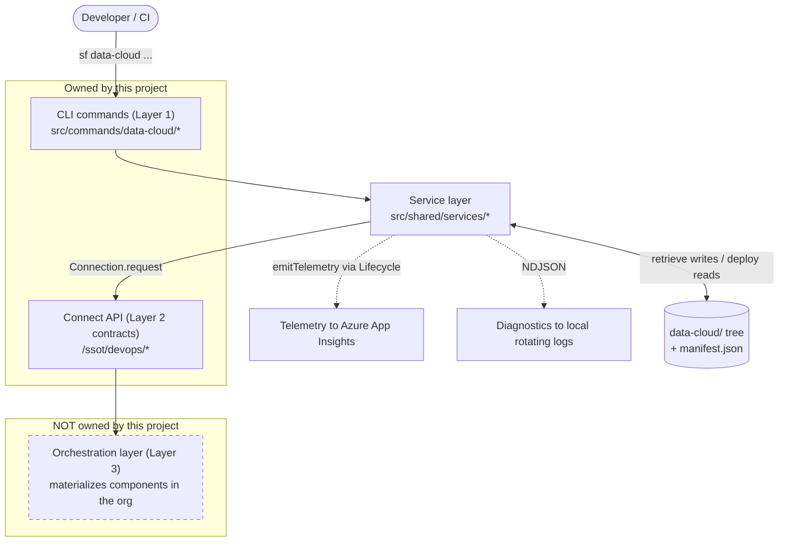

# @salesforce/plugin-datacloud-devops

<!-- PLACEHOLDER badges — replace the URLs/paths once CI, coverage, and npm publish are wired up. -->

[](#)
[](#)
[](#)
[](LICENSE.txt)

Source-controlled DevOps (retrieve and deploy) for **Data Cloud (Data 360)** components. This Salesforce CLI plugin is a **thin client** over a small set of Connect API endpoints under `/ssot/devops/*`: it retrieves a component plus its full server-resolved dependency graph, writes one human-readable JSON file per component into a deterministic, dataspace-aware `data-cloud/` tree you can commit to git, and deploys those files (in dependency order) to another org. The goal is parity with core `sf project retrieve` / `sf project deploy` — but for Data Cloud metadata.

> **Scope (be honest about it).** This project owns two layers: the **CLI** (Layer 1, this repo) and the **Connect API contracts** (Layer 2, the representation classes that define the request/response shapes). It does **not** own the Connect API _implementation_, the server-side dependency **spidering**, or the **orchestration layer** (Layer 3) that materializes components in the target org. Those are owned by a separate backend team. This README documents only what the CLI does and the wire contracts it depends on.

---

## Table of contents

- [Architecture](#architecture)
- [Prerequisites](#prerequisites)
- [Installation](#installation)
- [Quick start](#quick-start)
- [Commands](#commands)
  - [`data-cloud component-type list`](#sf-data-cloud-component-type-list)
  - [`data-cloud component list`](#sf-data-cloud-component-list)
  - [`data-cloud retrieve`](#sf-data-cloud-retrieve)
  - [`data-cloud deploy`](#sf-data-cloud-deploy)
  - [`data-cloud deploy status`](#sf-data-cloud-deploy-status)
  - [`data-cloud diagnostics`](#sf-data-cloud-diagnostics)
- [On-disk file layout](#on-disk-file-layout)
- [Environment variables](#environment-variables)
- [Development](#development)
- [Contributing](#contributing)
- [License](#license)

---

## Architecture

The CLI is deliberately thin. Every command follows the same shape: parse flags → resolve an authenticated `Connection` → make a **single** service-layer call → print a human-readable summary (auto-suppressed under `--json`) → return a typed result object. All HTTP, file I/O, and dependency-walking live in the service layer ([`src/shared/services/`](src/shared/services/)), never in the command classes.

Two independent side channels branch off the service layer and never affect a command's outcome:

- **Telemetry** — bounded, flat metrics emitted on the shared CLI `Lifecycle` telemetry channel. The `sf` CLI's own infrastructure subscribes and uploads them to **Azure App Insights**. See [`telemetry.ts`](src/shared/services/telemetry.ts).
- **Diagnostics** — richer, correlatable **NDJSON** written to a rotating **local** log directory for debugging a single run. Bundled on demand by `sf data-cloud diagnostics`. See [`src/shared/diagnostics/`](src/shared/diagnostics/).



If your Markdown viewer does not render Mermaid, here is the same picture in ASCII:

```text
  Developer / CI
        |  sf data-cloud ...
        v
  +-------------------------+
  | CLI commands (Layer 1)  |
  | src/commands/data-cloud |
  +-----------+-------------+
              |
              v
  +-------------------------+       .......> Telemetry  -> Azure App Insights
  | Service layer           |------:                       (telemetry.ts)
  | src/shared/services/*   |      :.......> Diagnostics -> local rotating NDJSON logs
  +-----------+-------------+                              (src/shared/diagnostics/)
              |  Connection.request               ^
              |                                    | retrieve writes / deploy reads
              v                                    v
  +-------------------------+            +-----------------------+
  | Connect API (Layer 2    |            | data-cloud/ tree      |
  | contracts) /ssot/devops |            | + manifest.json       |
  +-----------+-------------+            +-----------------------+
              |
              v
  +-------------------------+
  | Orchestration (Layer 3) |   <-- NOT owned by this project
  | materializes in the org |
  +-------------------------+
```

**Endpoints the service layer calls** — paths are built from the connection's resolved API version (`/services/data/v{apiVersion}/ssot/devops/...`), never hardcoded; see [`devops-api.ts:45`](src/shared/services/devops-api.ts#L45):

| Command               | HTTP endpoint                                                                            |
| --------------------- | ---------------------------------------------------------------------------------------- |
| `component-type list` | `GET /ssot/devops/component-types`                                                       |
| `component list`      | `GET /ssot/devops/component/catalog?componentType=<>&dataSpaceName=<>`                   |
| `retrieve`            | `GET /ssot/devops/component/snapshot?componentType=<>&componentName=<>&dataSpaceName=<>` |
| `deploy`              | `POST /ssot/devops/component/promotion`                                                  |
| `deploy status`       | `GET /ssot/devops/component/promotion/{jobId}`                                           |
| `diagnostics`         | _none — reads local log files only_                                                      |

> **Note (code vs. planning docs).** The endpoint paths above are read from the code and are the source of truth. They differ from the shorthand in `CLAUDE.md` (e.g. `POST /ssot/devops/deploy`, `GET /ssot/devops/deploy/{jobId}/status`): the implemented paths are namespaced under `/component/*` — `/component/catalog`, `/component/snapshot`, `/component/promotion`, `/component/promotion/{jobId}`. Follow the code.

---

## Prerequisites

- **Node.js.** The [`package.json`](package.json) `engines` field declares `>=18.0.0`, but the **team standard is Node v24** — match the toolchain used by other Salesforce CLI plugins. **Do not use Node v26**: it crashes the oclif plugin generator. Use a version manager (`nvm`, `volta`, …) pinned to v24.
- **Yarn.** This repo uses **Yarn only**. Do **not** run `npm install` — it produces a `package-lock.json` that conflicts with `yarn.lock` and the wireit / `sf-*` scripts.
- **Salesforce CLI (`sf`).** Install the latest `@salesforce/cli` globally. Verify with `sf --version`. You also need at least one authenticated org (`sf org login web`) to run the org-touching commands.

---

## Installation

Clone the repo, install dependencies, and link the plugin into your local `sf` install:

```bash
# 1. Install dependencies (NEVER run npm install)
yarn install

# 2. Build (compiles TypeScript to lib/ and lints)
yarn build

# 3a. Run without installing, straight from source (fastest dev loop):
./bin/dev.js data-cloud component-type list --src-org myOrg

# 3b. ...or link the built plugin so `sf data-cloud ...` works globally:
sf plugins link .
sf plugins            # confirm it appears as a linked plugin
```

- `./bin/dev.js <command>` runs the command from TypeScript source via `ts-node` — no build step required, ideal while iterating.
- `sf plugins link .` registers the compiled `lib/` output with your global `sf`. Run `yarn build` first (and after changes) so `lib/` is current.
- To remove the link later: `sf plugins unlink @salesforce/plugin-datacloud-devops`.

---

## Quick start

An end-to-end **retrieve → commit → deploy → poll** flow. Assume `dev-org` is your source and `uat-org` is your target, both authenticated with `sf org login web`.

**1. Discover what you can work with:**

```bash
sf data-cloud component-type list --src-org dev-org
sf data-cloud component list --component-type CalculatedInsight --dataspace default --src-org dev-org
```

**2. Retrieve a component and its full dependency graph to disk:**

```bash
sf data-cloud retrieve --component CalculatedInsight:highValueCustomer --dataspace default --src-org dev-org
```

```text
✓ Retrieved 2 components (full dependency graph):
  - CalculatedInsight:highValueCustomer
  - DataModelObject:Divvy_TripsDmo

Files written to ./data-cloud/default/
```

**3. Review and commit the generated files** — they are plain, indented JSON, safe to diff and version:

```bash
git add data-cloud/
git commit -m "chore(data-cloud): retrieve highValueCustomer CI + deps"
```

**4. Deploy to the target org** (asynchronous — returns immediately with a job ID):

```bash
sf data-cloud deploy --component CalculatedInsight:highValueCustomer --dataspace default --target-org uat-org
```

```text
✓ Deployment submitted for CalculatedInsight:highValueCustomer in dataspace default.
Status: SUBMITTED
Job ID: 08PVF000002iQIb

Track progress with: sf data-cloud deploy status --job-id 08PVF000002iQIb --target-org <org>
```

**5. Poll the job until it finishes:**

```bash
sf data-cloud deploy status --job-id 08PVF000002iQIb --target-org uat-org
```

```text
Job ID: 08PVF000002iQIb
Status: SUCCEEDED

 Component            Type               Status
 ──────────────────── ────────────────── ─────────
 highValueCustomer    CalculatedInsight  SUCCEEDED
 Divvy_TripsDmo       DataModelObject    SUCCEEDED
```

Every command also supports `--json` for scripting and agent use.

---

## Commands

The CLI namespace is `data-cloud`. All command output shown below is the human-readable form (auto-suppressed under `--json`, which instead emits the returned result object). Common flags:

- `--api-version` — override the org's API version for this call (default: the org's resolved version). Available on every org-touching command.
- `--json` — machine-readable output. Global to all `sf` commands.

> The `--src-org` flag also accepts the alias `--target-org` on the read commands (`component-type list`, `component list`, `retrieve`) for muscle-memory parity with core `sf` commands.

### sf data-cloud component-type list

List the Data Cloud component types supported for retrieve and deploy. The key is the value you pass to other commands (e.g. `CalculatedInsight`); the value is its display label. Maps to `GET /ssot/devops/component-types` ([`component-type/list.ts:27`](src/commands/data-cloud/component-type/list.ts#L27)).

| Flag            | Alias          | Required | Description                                                       |
| --------------- | -------------- | -------- | ----------------------------------------------------------------- |
| `--src-org`     | `--target-org` | yes      | Username or alias of the source org to list component types from. |
| `--api-version` |                | no       | Override the org's API version.                                   |

```bash
sf data-cloud component-type list --src-org dev-org
```

```text
 Component Type      Label
 ─────────────────── ──────────────────
 CalculatedInsight   Calculated Insight
 DataModelObject     Data Model Object
 DataLakeObject      Data Lake Object
 DataTransform       Data Transform

Found 4 supported component types.
```

### sf data-cloud component list

List the components of a given type within a dataspace. Pass a `--component-type` value from `component-type list`. Maps to `GET /ssot/devops/component/catalog?componentType=<>&dataSpaceName=<>` ([`component/list.ts:27`](src/commands/data-cloud/component/list.ts#L27)).

| Flag               | Alias          | Required | Description                                                                                           |
| ------------------ | -------------- | -------- | ----------------------------------------------------------------------------------------------------- |
| `--component-type` | `--type`       | yes      | API name of the component type to filter by (e.g. `CalculatedInsight`).                               |
| `--dataspace`      |                | no       | Developer name of the dataspace to scope to. If omitted, the org's default dataspace context is used. |
| `--src-org`        | `--target-org` | yes      | Username or alias of the source org to list components from.                                          |
| `--api-version`    |                | no       | Override the org's API version.                                                                       |

```bash
sf data-cloud component list --component-type CalculatedInsight --dataspace default --src-org dev-org
```

```text
 Component Name
 ──────────────────
 highValueCustomer
 churnRiskScore

Found 2 components matching type 'CalculatedInsight' in dataspace 'default'.
```

### sf data-cloud retrieve

Retrieve a component **plus its full server-resolved dependency graph** from a source org. Writes one JSON file per component into the local `data-cloud/` tree, along with a `manifest.json` capturing the deployment order. Maps to `GET /ssot/devops/component/snapshot` ([`retrieve.ts:27`](src/commands/data-cloud/retrieve.ts#L27)).

| Flag            | Alias          | Required | Description                                                                                                                                    |
| --------------- | -------------- | -------- | ---------------------------------------------------------------------------------------------------------------------------------------------- |
| `--component`   |                | yes      | The component to retrieve, in `TYPE:NAME` format (e.g. `CalculatedInsight:highValueCustomer`).                                                 |
| `--dataspace`   |                | no       | Developer name of the dataspace context. If omitted, the org's default dataspace is used and components are written to the `data-cloud/` root. |
| `--src-org`     | `--target-org` | yes      | Username or alias of the source org.                                                                                                           |
| `--api-version` |                | no       | Override the org's API version.                                                                                                                |

```bash
sf data-cloud retrieve --component CalculatedInsight:highValueCustomer --dataspace default --src-org dev-org
```

```text
✓ Retrieved 2 components (full dependency graph):
  - CalculatedInsight:highValueCustomer
  - DataModelObject:Divvy_TripsDmo

Files written to ./data-cloud/default/
```

> The server does the dependency **spidering**, not the CLI. The per-component raw payload the API returns is written verbatim to disk under `entityPayload` and is otherwise stripped from the command's result — see [On-disk file layout](#on-disk-file-layout).

### sf data-cloud deploy

Deploy a component and its dependencies to a target org. The command reads the named component plus its transitive dependencies from the **local** `data-cloud/` tree and submits them. The deploy runs **asynchronously**: the call returns immediately with status `SUBMITTED` and a tracking job ID. Maps to `POST /ssot/devops/component/promotion` ([`deploy/index.ts:27`](src/commands/data-cloud/deploy/index.ts#L27)).

| Flag            | Alias | Required | Description                                                                                   |
| --------------- | ----- | -------- | --------------------------------------------------------------------------------------------- |
| `--component`   |       | yes      | The component to deploy, in `TYPE:NAME` format (e.g. `CalculatedInsight:HighValueCustomers`). |
| `--dataspace`   |       | **yes**  | Developer name of the dataspace context.                                                      |
| `--target-org`  |       | yes      | Username or alias of the target org to deploy to.                                             |
| `--api-version` |       | no       | Override the org's API version.                                                               |

> **Note.** Unlike `retrieve`, `deploy` requires `--dataspace`, and its org flag is `--target-org` **with no `--src-org` alias** (see [`deploy/index.ts:44`](src/commands/data-cloud/deploy/index.ts#L44)).

```bash
sf data-cloud deploy --component CalculatedInsight:HighValueCustomers --dataspace default --target-org uat-org
```

```text
✓ Deployment submitted for CalculatedInsight:HighValueCustomers in dataspace default.
Status: SUBMITTED
Job ID: 08PVF000002iQIb

Track progress with: sf data-cloud deploy status --job-id 08PVF000002iQIb --target-org <org>
```

### sf data-cloud deploy status

Poll the status of an asynchronous deploy job. Reports the overall job status and a per-component breakdown. A completed job reports `SUCCEEDED`; an in-progress job reports `INPROGRESS`; a failed job reports each failing component and the reason it failed. Maps to `GET /ssot/devops/component/promotion/{jobId}` ([`deploy/status.ts:27`](src/commands/data-cloud/deploy/status.ts#L27)).

| Flag            | Alias | Required | Description                                                     |
| --------------- | ----- | -------- | --------------------------------------------------------------- |
| `--job-id`      | `-i`  | yes      | The tracking job ID returned by the initial deployment request. |
| `--target-org`  |       | yes      | Username or alias of the destination org.                       |
| `--api-version` |       | no       | Override the org's API version.                                 |

```bash
sf data-cloud deploy status --job-id 08PVF000002iQIb --target-org uat-org
```

```text
Job ID: 08PVF000002iQIb
Status: SUCCEEDED

 Component            Type               Status
 ──────────────────── ────────────────── ─────────
 highValueCustomer    CalculatedInsight  SUCCEEDED
```

On failure the per-component reason is surfaced (structured and actionable — never a raw gack):

```text
Job ID: 08PVF000002iQIb
Status: FAILED

 Component            Type               Status
 ──────────────────── ────────────────── ─────────
 highValueCustomer    CalculatedInsight  FAILED

Error details for component 'highValueCustomer':
Reason: Referenced Data Model Object 'Divvy_TripsDmo' does not exist in the target dataspace.
```

> **Display vs. contract.** The backend's terminal enum on the wire is PascalCase `Success`, which the service normalizes to the contract value `SUCCESS` (see [`deploy-status-service.ts:48`](src/shared/services/deploy-status-service.ts#L48)); the CLI then displays it as `SUCCEEDED` for readability. The `--json` output keeps the normalized contract value (`SUCCESS`) — only the printed text is mapped (see [`deploy/status.ts:60`](src/commands/data-cloud/deploy/status.ts#L60)). An empty component table means the job is still queued (`CREATED`), before any per-component rows exist.

### sf data-cloud diagnostics

Bundle the local diagnostic logs this plugin writes into a single gzipped tar archive you can attach to a support request. Touches **no org** and **no wire contract** — it reads the on-disk log directory and packs what it finds. Secrets are redacted and absolute paths are scrubbed to `~` when the logs are written, so the archive is safe to share. See [`diagnostics.ts`](src/commands/data-cloud/diagnostics.ts).

| Flag            | Alias | Required | Default                     | Description                                                                               |
| --------------- | ----- | -------- | --------------------------- | ----------------------------------------------------------------------------------------- |
| `--days`        |       | no       | `3`                         | Include diagnostic log files modified within this many days (minimum `1`).                |
| `--output`      | `-o`  | no       | timestamped file in the cwd | Path to write the archive to.                                                             |
| `--include-env` |       | no       | `false`                     | Include non-sensitive environment details (plugin, Node, and OS versions) in the archive. |

```bash
# Bundle the last 3 days into a timestamped archive in the current directory:
sf data-cloud diagnostics

# Bundle the last 7 days, including environment details, to a specific file:
sf data-cloud diagnostics --days 7 --include-env --output ./datacloud-diag.tar.gz
```

```text
Wrote diagnostic bundle to /Users/you/datacloud-diagnostics-2026-07-13T09-41-02.tar.gz
Included 6 log file(s) from the last 7 day(s).
```

The archive contains a `logs/` directory with the collected NDJSON files and a `manifest.json` index. With `--include-env`, it also adds an `environment.json` with the plugin, Node, and OS versions plus allowlisted log-configuration variables. To capture more detail before reproducing an issue, raise verbosity with `SF_DATACLOUD_LOG_LEVEL=DEBUG` (or `TRACE`) — see [Environment variables](#environment-variables).

---

## On-disk file layout

`retrieve` writes a deterministic, dataspace-aware tree under `data-cloud/` in the current working directory. The rules (see [`component-paths.ts`](src/shared/constants/component-paths.ts)):

- **1 component = 1 file**, named `<componentName>.json` — the file stem **is** the component's API name (deterministic; no random IDs).
- Folder names are **kebab-case and plural**, **derived at runtime** from the backend `componentType` (`CalculatedInsight` → `calculated-insights/`, `DataModelObject` → `data-model-objects/`). There is no hardcoded catalog, so a brand-new backend type gets a correct folder with zero CLI changes (see [`folderForComponentType`, `component-paths.ts:78`](src/shared/constants/component-paths.ts#L78)).
- Dataspace-scoped components live under `data-cloud/<dataspace>/<type-folder>/`. Components that are **dataspace-agnostic** (currently `DataLakeObject`, see [`component-paths.ts:93`](src/shared/constants/component-paths.ts#L93)) — or that have no dataspace — are routed to the `data-cloud/` **root**, outside any dataspace folder.
- A root `data-cloud/manifest.json` holds the flattened `deploymentOrder`.

```text
data-cloud/
├── manifest.json                       # flattened deploymentOrder for the retrieve
├── data-lake-objects/                  # dataspace-agnostic (org-level) definitions at root
│   └── Divvy_Trips.json
└── default/                            # one folder per dataspace
    ├── calculated-insights/
    │   └── highValueCustomer.json
    └── data-model-objects/
        └── Divvy_TripsDmo.json
```

Each component file is **self-describing** — exactly five fields ([`file-layout.ts:28`](src/shared/types/file-layout.ts#L28)). `entityPayload` is stored verbatim (native JSON, never DataKit XML or `&quot;`-encoded text) so it round-trips byte-for-byte on deploy:

```json
{
  "componentType": "CalculatedInsight",
  "componentName": "individual_count_by_sourceId",
  "dataspaceName": "default",
  "dependsOn": [],
  "entityPayload": {
    "creationType": "Custom",
    "definitionType": "CALCULATED_METRIC",
    "expression": "SELECT COUNT(ssot__Individual__dlm.ssot__Id__c) AS individual_count__c FROM ssot__Individual__dlm GROUP BY ssot__Individual__dlm.ssot__DataSourceId__c",
    "masterLabel": "individual_count_by_sourceId",
    "scheduleInterval": "0",
    "sourceObjectDevName": "individual_count_by_sourceId"
  }
}
```

A component with dependencies lists them in `dependsOn` (type + API name), which the deploy walker follows to assemble the full submission set:

```json
{
  "componentType": "CalculatedInsight",
  "componentName": "highValueCustomer",
  "dataspaceName": "default",
  "dependsOn": [{ "componentName": "Divvy_TripsDmo", "componentType": "DataModelObject" }],
  "entityPayload": { "...": "type-specific definition, stored verbatim" }
}
```

The `manifest.json` records the deployment order with three keys per entry:

```json
{
  "deploymentOrder": [
    { "componentType": "DataModelObject", "componentName": "Divvy_TripsDmo", "dataspaceName": "default" },
    { "componentType": "CalculatedInsight", "componentName": "highValueCustomer", "dataspaceName": "default" }
  ]
}
```

---

## Environment variables

All are optional. The **diagnostic** (local NDJSON) channel is configured entirely by env vars; the **telemetry** channel is governed by the standard `sf` CLI telemetry setting.

| Variable                        | Default          | Effect                                                                                                                                                                                                                                                   |
| ------------------------------- | ---------------- | -------------------------------------------------------------------------------------------------------------------------------------------------------------------------------------------------------------------------------------------------------- |
| `SF_DATACLOUD_LOG_LEVEL`        | `INFO`           | Global diagnostic verbosity: `OFF` \| `ERROR` \| `INFO` \| `DEBUG` \| `TRACE`. Case-insensitive; an invalid value falls back to `INFO`.                                                                                                                  |
| `SF_DATACLOUD_LOG_LEVEL_API`    | inherits global  | Per-subsystem override for the **API** subsystem (HTTP requests).                                                                                                                                                                                        |
| `SF_DATACLOUD_LOG_LEVEL_DEPLOY` | inherits global  | Per-subsystem override for the **DEPLOY** subsystem.                                                                                                                                                                                                     |
| `SF_DATACLOUD_LOG_LEVEL_FILEIO` | inherits global  | Per-subsystem override for the **FILEIO** subsystem (disk reads/writes).                                                                                                                                                                                 |
| `SF_DATACLOUD_LOG_DIR`          | platform default | Override the directory diagnostic logs are written to. Platform defaults: `~/Library/Logs/salesforce-datacloud-devops` (macOS), `%LOCALAPPDATA%\salesforce-datacloud-devops\logs` (Windows), `$XDG_STATE_HOME/salesforce-datacloud-devops/logs` (Linux). |
| `SF_DISABLE_TELEMETRY`          | unset            | Standard `sf` CLI setting. When `true`, the CLI's telemetry infrastructure does not upload events. This plugin emits on the shared `Lifecycle` channel; it does not implement its own opt-out.                                                           |

Sources: [`config.ts`](src/shared/diagnostics/config.ts), [`event.ts:33`](src/shared/diagnostics/event.ts#L33) (levels), [`storage.ts:62`](src/shared/diagnostics/storage.ts#L62) (log directory). The `CORE` subsystem has no dedicated override — it always follows the global level.

**Log rotation / retention** (fixed, from [`storage.ts:37`](src/shared/diagnostics/storage.ts#L37)): the active file rolls at **50 MB**, at most **10** files are kept, and files older than **7 days** are pruned.

> **Not yet active (documented for accuracy).** The code defines a CLI-to-backend correlation header (`x-correlation-id`) gated by an internal `SEND_CORRELATION_HEADER` flag that ships **`false`** — the correlation id is minted and emitted in telemetry but is **not** sent on the wire until the backend confirms the header name ([`devops-api.ts:57`](src/shared/services/devops-api.ts#L57)). Similarly, gack-id extraction from error messages ships **disabled** ([`telemetry.ts:94`](src/shared/services/telemetry.ts#L94)). Neither is an environment variable; they are compile-time gates noted here so the behavior is not mistaken for a bug.

### Telemetry events

The plugin emits these event names on the `Lifecycle` telemetry channel (all prefixed `DATACLOUD_DEVOPS_`), carrying only bounded, non-PII-shaped primitives (counts, durations, booleans, `orgId`, a shape-guarded component **type**):

- `DATACLOUD_DEVOPS_API_REQUEST`
- `DATACLOUD_DEVOPS_RETRIEVE_COMPONENT`
- `DATACLOUD_DEVOPS_DEPLOY_COMPONENT`
- `DATACLOUD_DEVOPS_DEPLOY_COMPONENT_FAILURE`
- `DATACLOUD_DEVOPS_DEPLOY_STATUS_POLL`

---

## Development

```bash
yarn build              # Compile TypeScript to lib/ and run ESLint (wireit graph: compile + lint)
yarn compile            # Compile only (tsc, incremental)
yarn lint               # ESLint across src/ and test/
yarn test               # Full suite: unit (mocha/nyc), command-reference, deprecation-policy,
                        # JSON-schema compare, lint, and Markdown link-check
yarn test:only          # Unit tests only (test/**/*.test.ts)
yarn test:nuts          # Non-unit tests (NUTs) against a real org (**/*.nut.ts)
yarn format             # Prettier write

./bin/dev.js <command>  # Run a command from source without building
```

- **Language / framework:** TypeScript on **oclif**, packaged as an **ESM** module (`"type": "module"`; use `.js` import extensions in source). Commands extend `SfCommand` from `@salesforce/sf-plugins-core`.
- **Testing:** mocha + chai + nyc for unit tests; `@salesforce/cli-plugins-testkit` for NUTs. Coverage target is **≥80%**.
- **Command messages** live in [`messages/`](messages/) as Markdown bundles (summaries, flag help, examples, output strings) — keep command flags and their message keys in sync.
- **Snapshots & schemas:** `yarn test` runs `snapshot:compare` (deprecation policy) and `schema:compare`. If you intentionally change a command's public surface, regenerate the snapshot/schema before committing.
- **Commits:** follow **Conventional Commits** (`feat:`, `fix:`, `chore:`, `test:`, …).

---

## Contributing

Contributions follow the standard Salesforce CLI plugin workflow: branch, keep changes modular and typed, add tests to preserve ≥80% coverage, and use Conventional Commit messages. Repository governance files:

- [`CONTRIBUTING.md`](CONTRIBUTING.md) — the full contributor workflow.
- [`CODE_OF_CONDUCT.md`](CODE_OF_CONDUCT.md)
- [`SECURITY.md`](SECURITY.md)
- [`LICENSE.txt`](LICENSE.txt)
- [`CODEOWNERS`](CODEOWNERS)

For architecture, exact scope boundaries, and the full API/file contracts, see [`PROJECT_KNOWLEDGE.md`](PROJECT_KNOWLEDGE.md) (the project's single source of truth) and the guidance for AI agents in [`CLAUDE.md`](CLAUDE.md).

---

## License

[Apache-2.0](LICENSE.txt) — see [`package.json`](package.json) (`"license": "Apache-2.0"`). Copyright Salesforce, Inc.
